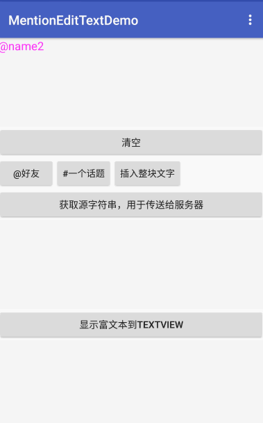

## MentionEditText
MentionEditText adds some useful features for mention string(@xxxx,#xxx#), such as highlight, intelligent deletion, intelligent selection and '@' and '#' input detection, etc.

## ScreenShot



## Usage
```java
@Override protected void onCreate(Bundle savedInstanceState) {
    super.onCreate(savedInstanceState);
// ....
// listening the mention character input
    if (null == mOnMentionInputListener) {
      mOnMentionInputListener = new OnMentionInputListener() {
        @Override public void onMentionCharacterInput(char charSequence) {
          if (charSequence == mMentionedittext.getMentionChar()) {
            startActivityForResult(UserList.getIntent(mMainActivity), REQUEST_USER_APPEND);
          } else if (charSequence == mMentionedittext.getTagChar()) {
            startActivityForResult(TagList.getIntent(mMainActivity), REQUEST_TAG_APPEND);
          }
        }
      };
      mMentionedittext.addOnMentionInputListener(mOnMentionInputListener);
    }

// convert metion character to string,such as @BoBoMEe -> (@BoBoMEe,id=xxx)
    mBtnCovert.setOnClickListener(new View.OnClickListener() {
      @Override public void onClick(View v) {
        String convertMetionString = mMentionedittext.convertMetionString();
        mCovertedString.setText(convertMetionString);
      }
    });
  }

// activity result
@Override protected void onActivityResult(int requestCode, int resultCode, Intent data) {
    if (resultCode == Activity.RESULT_OK && null != data) {
      switch (requestCode) {
       //...
        case REQUEST_USER_APPEND:
          User user1 = data.getParcelableExtra(UserList.RESULT_USER);
          mMentionedittext.appendUser(user1.getUserId(), user1.getUserName());
          break;
        case REQUEST_TAG_APPEND:
          Tag tag1 = data.getParcelableExtra(TagList.RESULT_TAG);
          mMentionedittext.appendTag(tag1.getTagId(), tag1.getTagLable());
          break;
      }
    }
    super.onActivityResult(requestCode, resultCode, data);
  }
```

## Setting
- `setMentionTextColor(int color);` : default is `Color.RED`.
- `setMentionChar(char mentionchar);` : default is `'@'`
- `setMentionTextFormat(String format);` : default is `"(@%s:%s)"`

- `setTagTextColor(int color);` : default is `Color.BLUE`
- `setTagChar(char mentionchar);` : default is `'#'`
- `setTagTextFormat(String format);` : default is `"[#%s:%s]"`

more usage:[MainActivity.java](https://github.com/BoBoMEe/MentionEditText/blob/master/app/src/main/java/com/bobomee/android/mentionedittextdemo/MainActivity.java)

## Thanks

[luckyandyzhang/MentionEditText](https://github.com/luckyandyzhang/MentionEditText)